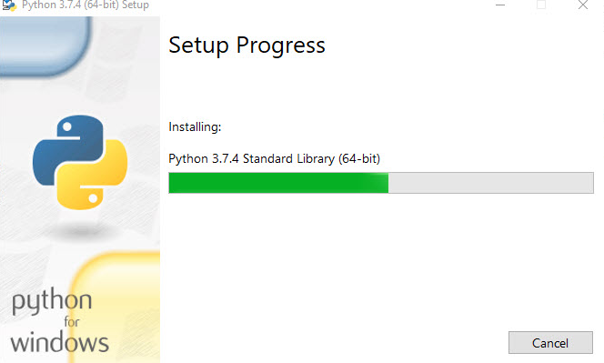
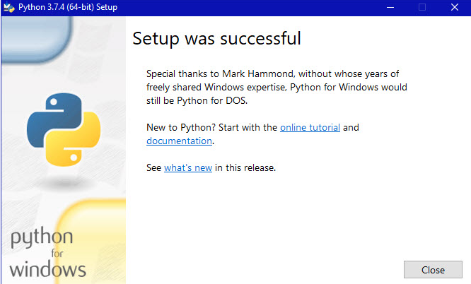

 # 
*_Programming In Python_* 

 ## 
**Beginners Guide** 

 
Contents

What is Python? 
Installing Python 
Features of Python 
Data types used python 
My First Program

First lets define what is python?

 

 * Python is a high-level programming language designed to be easy to read and simple to implement.

 * Python is a programming language created by **Guido van Rossum**.

 * In this guide lets learn the basics of python.

 * You will also be able to write your first simple program in python.

 
 
## Installing Python
### Downloading

 

 
 * Lets follow the stepwise method to install python on your own devices

**Step1:** 

Click on <u>[pythondownload](https://www.python.org/ downloads/)</u> 
&nbsp;&nbsp;&nbsp;&nbsp;&nbsp; The page below will  appear on your brower

**Step2:** 

* Select the link based on your OS.Click on **Windows** link if ur an windows user 
* The python releases for windows will appear.
* Based on the system type select the downloads.

**Step3:** 

* Click on the Download <u>**Windows x86-64 executable**</u> installer link which is below the Stable Releases.

* An pop window will appear.Click savefile button.
* The python will start downloading.
* Start installing directly.

### Installing

**Step1:**

* Double click the downloaded file.
* An **Setup** Window will pop up.

* Check that both checkboxes below are checked.

**Step2:**

* Click on the **Install Now**.when you open, an User Account control window will pop-up asking do you want to allow this app to make changes to your device.
* Click the Yes.A new Python 3.7.4 (64-bit) Setup pop-up window will start a Setup Progress message and a progress bar.

**Step3:**

* After the completion of installation,a new Python 3.7.4(64-bit) Setup window will pop-up stating Setup was successfull.

