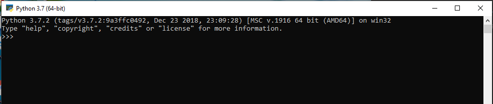

 # 
*_Programming In Python_* 

 ## 
**Beginners Guide** 

 
Contents

What is Python? 
Installing Python 
Features of Python 
Data types used python 
My First Program

&nbsp;&nbsp;&nbsp;&nbsp;First lets define what is python?

 

 * Python is a high-level programming language designed to be easy to read and simple to implement.

 * Python is a programming language created by **Guido van Rossum**.

 * In this guide lets learn the basics of python.

 * You will also be able to write your first simple program in python.

 
 
## Installing Python
### Downloading

 

 
 * Lets follow the stepwise method to install python on your own devices

**Step1:** 

Click on <u>[pythondownload](https://www.python.org/ downloads/)</u> 
&nbsp;&nbsp;&nbsp;&nbsp;&nbsp; The page below will  appear on your brower

 
 

**Step2:** 

* Select the link based on your OS.Click on **Windows** link if ur an windows user 
* The python releases for windows will appear.
* Based on the system type select the downloads.

**Step3:** 

* Click on the Download <u>**Windows x86-64 executable**</u> installer link which is below the Stable Releases.

* An pop window will appear.Click savefile button.
* The python will start downloading.
* Start installing directly.

### Installing

**Step1:**

* Double click the downloaded file.
* An **Setup** Window will pop up.

* Check that both checkboxes below are checked.

**Step2:**

* Click on the **Install Now**.when you open, an User Account control window will pop-up asking do you want to allow this app to make changes to your device.
* Click the Yes.A new Python 3.7.4 (64-bit) Setup pop-up window will start a Setup Progress message and a progress bar.

**Step3:**

* After the completion of installation,a new Python 3.7.4(64-bit) Setup window will pop-up stating Setup was successfull.

* Click on close button

### Verification 

* To verify the installation
Navigate to the directory where your python has been installed 
* Double click the icon Double-click the icon/file python.exe.
The following pop-up window will appear.

 A pop-up window with the title Python3.7(64-bit) appears and check whether its the 64 bit installed,at the bottom left, is the prompt >>>: type exit() to this prompt and press enter to terminate Python.

## Features Of Python

1. **A simple language which is easier to learn**

Python has a very simple and elegant syntax. It's much easier to read and write compared to other languages like: C++, Java, C#.Python is easy and makes programming fun.

2. **Free and open-source**

You can freely use and distribute Python, even for commercial use. Not only can you use and distribute softwares written in it, you can even make changes to the Python's source code.

3. **Portability**

You can move Python programs from one platform to another, and run it without any changes.
It runs seamlessly on almost all platforms including Windows, Mac OS X and Linux.

4. **Extensible and Embeddable**

Suppose an application requires high performance. You can easily combine pieces of C/C++ or other languages with Python code.
This will give your application high performance as well as scripting capabilities which other languages may not provide out of the box.

5. **High-level, interpreted language**

Unlike C/C++, you don't have to worry about daunting tasks like memory management, garbage collection and so on. when you run Python code, it automatically converts your code to the language your computer understands. You don't need to worry about any lower-level operations.

6. **Large standard libraries to solve common tasks**

Python has a number of standard libraries which makes life of a programmer much easier since you don't have to write all the code yourself. For example: Need to connect MySQL database on a Web server? You can use MySQLdb library using import MySQLdb .

7. **Object-oriented**

Everything in Python is an object. Object oriented programming (OOP) helps you solve a complex problem intuitively.
With OOP, you are able to divide these complex problems into smaller sets by creating objects.

## My First Program

The simple program on python appears as given below

 ~~~ 
     #Addition of two numbers
     num1 = 5
     num2 = 8
     sum = num1+num2
     print(sum)
~~~
   
   The rendered output for the given program appears
~~~
13

In [1]: 
~~~

Lets now understand how this program works 

**Line 1:** # Addition of two numbers

This line in python is treated as an comment line since it begins with #. Comments are used to describe the purpose of the code. This helps us and other programmers to understand the purpose of the code. Compilers and interpreters ignores the comment.

**Line 2:** num1 = 5

In this line num1 is a variable. You can store a value in a variable. Here, the stored value of num1 is 5 

**Line 3:** num2 = 8

Similarly, 8 is stored value for num2 variable.

**Line 4:** sum = num1+num2

The num1 and num2 variables are added using + operator.The variable **sum** will store the result of the operation.

**Line 5:** print(sum)

The print() is an function and this function is used to print the output to the screen.The output for this  program is 13.

